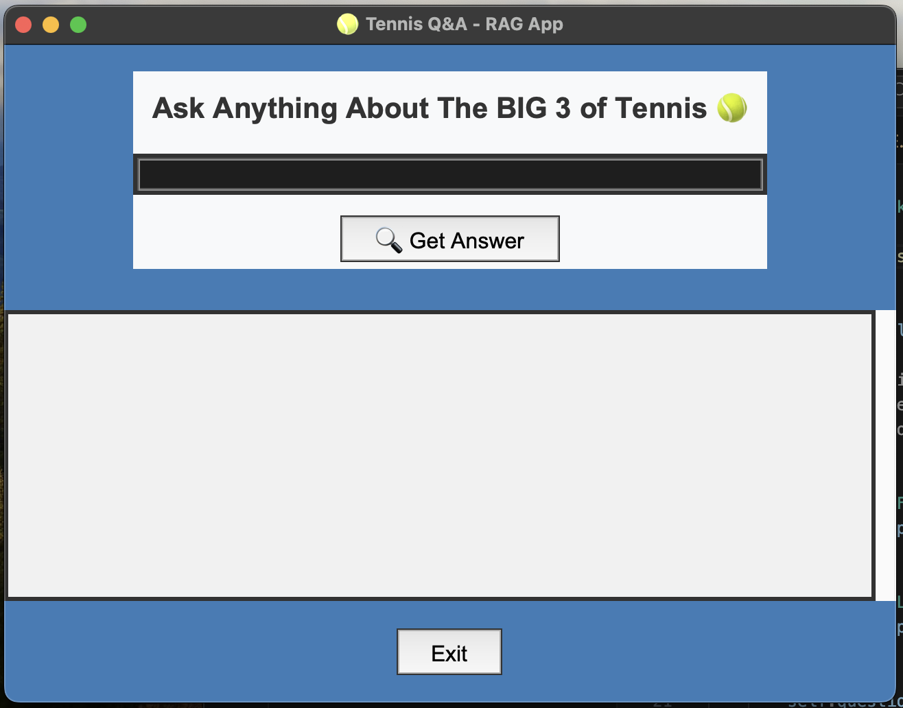

# 🎾 Tennis Q&A — RAG Pipeline


This project is a small **Retrieval-Augmented Generation (RAG) application** built to answer questions about Tennis "Gig 3" (Novak Djokovic, Roger Federer, Rafael Nadal) using a local knowledge base of `.txt` documents.

It demonstrates how to combine **document search** and **AI text generation** using Python, FAISS, and HuggingFace models.

---

## 🚀 What this program does

1 - Splits long tennis articles into small, meaningful text chunks  
2 - Converts these chunks into vector embeddings  
3 - Stores them in a FAISS vector database for fast similarity search  
4 - When the user asks a question:
- It finds the most relevant chunks
- It passes the context to a pre-trained language model (`Flan-T5`)  
- ✅ Returns a final, AI-generated answer

---

## 📂 Project Structure
```text
RAG_Model/
├── Code/
│   ├── logic.py      # Terminal interface version
│   └── gui_app.py           # GUI application version
├── data/
│   ├── doc_file1.txt    # Sample tennis document
│   ├── doc_file2.txt    # Additional knowledge files
│   └── doc_file3.txt
│── image/
│   └── Big3.jpg
├── .gitignore
├── requirements.txt
└── README.md
```

## 🔧 Installation & Running

### 1. Clone the Repository

```bash
git clone https://github.com/Semne77/RAG_Model.git
cd RAG_Model
```
### 2. Create virtual environment

```bash
python3 -m venv .venv
source .venv/bin/activate  # Mac/Linux
. .\.venv\Scripts\Activate   # Windows
```

### 3. Install dependencies to run the project
```bash
pip install -r requirements.txt
```


### 4. Run the program
```bash
cd Code
python gui_app.py
```

### 5. User interface will appear




## Sample Questions that you may ask:

```text
- Which player is from Spain?

- Which player knows English, German and French languages?

- Which player won all nine ATP Masters 1000 tournaments?
```

**Note:** This project uses the Flan-T5 model from Hugging Face, which is publicly available and **does not require** an API token.
However, if you want to use gated models or avoid rate limits, you may add your Hugging Face API token to your environment:

   ```bash
   export HUGGINGFACEHUB_API_TOKEN=your_token_here